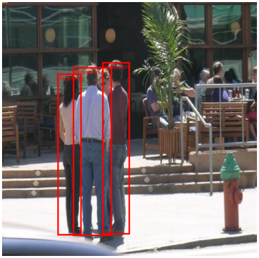
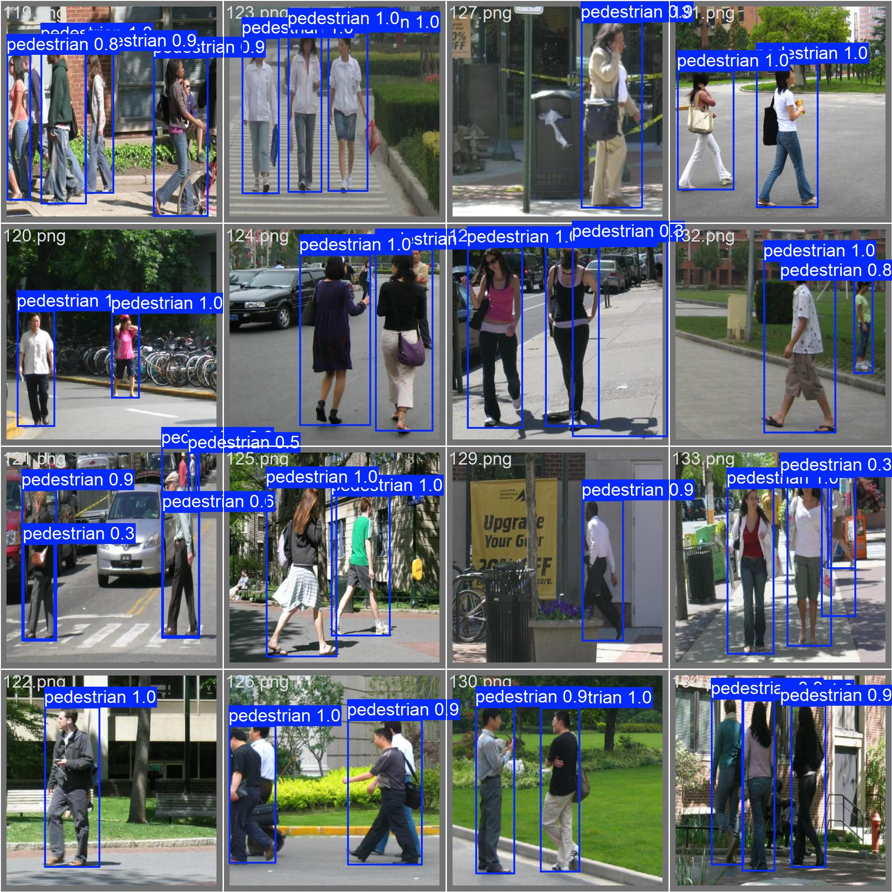
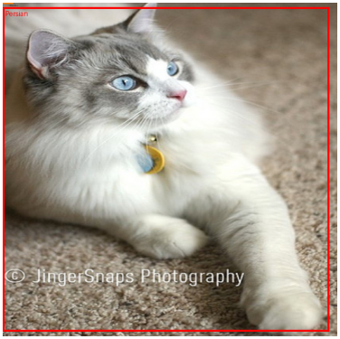
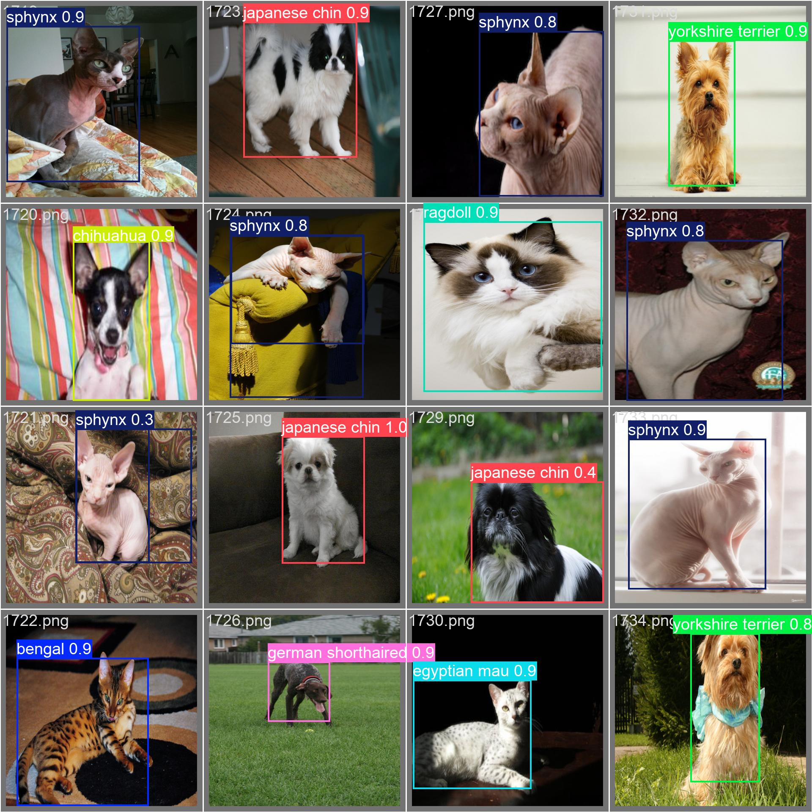

# DSDA 385 - Homework 2

## Introduction
The objective of this assignment was to train and evaluate two object detection models on small datasets. We intend to understand how these architectures work with limited data and GPU memory.

## Datasets
The two datasets we used were the Penn-Fudan Pedestrian dataset, and the Oxford-IIIT Pet dataset. Both datasets involve images with the objects we wish to detect and annotations that include the bounding boxes for those objects.

The Penn-Fudan dataset only involves detection of pedestrians, while the Oxford-IIIT dataset also involves classification of the different pet breeds.

I preprocessed every image to be 512x512 by scaling both the images and their bounding boxes. [prepare_yolo.py](prepare_yolo.py) also involves special preprocessing steps for both datasets that ensures that they can be trained on by the YOLOv8n model. This is because the ultralytics package requires a specific format for the data.

## Models
We trained both datasets on the Faster R-CNN and YOLOv8n models. The Faster R-CNN has a MobileNet backbone which means it is best for devices with little amounts of memory, and the low number of weights also makes it faster to train.

The YOLOv8n model is also very small, being only about 6 MB. This means it is also very well suited for devices with low memory and has very fast training and inference, even compared to the R-CNN model.

## Training
Training for the R-CNN model was coded manually as we would for any other model. We initialize the model, use the SGD optimizer, and train it for either 10 or 15 epochs, depending on the dataset. Training took less than a minute for the Penn-Fudan dataset, and a little over 10 minutes for the Oxford-IIIT dataset.

Training for the YOLO model was different as essentially the entire process was handled through the ultralytics package. For that, we just initialized the model with the pretrained weights, told ultralytics to train it, and it returned results and the best weights obtained during training.

## Results
### Comparison Table
|Dataset|Model|mAP @ 0.5|Precision|Recall|Training Time|Inference Speed|Notes|
|-------|-----|---------|---------|------|-------------|--------|------|
|Penn-Fudan|Faster R-CNN|0.9927|0.7572|0.8070|49.63 seconds|33.97 images/sec|batch 4, 10 epochs|
|Penn-Fudan|YOLOv8n|0.9899|0.9831|0.9375|71.60 seconds|87.72 images/sec|batch 8, 10 epochs|
|Oxford-IIIT|Faster R-CNN|0.8717|0.6971|0.7379|640.32 seconds|61.44 images/sec|batch 4, 15 epochs|
|Oxford-IIIT|YOLOv8n|0.9459|0.9007|0.9004|846.00 seconds|135.87 images/sec|batch 8, 15 epochs|

### Example Predictions
Penn-Fudan R-CNN

Penn-Fudan YOLO

Oxford-IIIT R-CNN

Oxford-IIIT YOLO

## Conclusion
The YOLO model gave the better results between the two in terms of both the evaluation metrics and the inference time. I feel like I had a more fulfilling experience training the R-CNN, however, due to the fact that I had to actually write the code that trained it.

In contrast, for the YOLO model, it felt like I was just initializing and having something else handle the implementation. I still have no idea how either the R-CNN or the YOLO model works underneath, but even less so with the YOLO model.

If I were to do a project similar to this again, I would likely try to implement my own detection model instead of training on premade models. Even though I understand the concepts behind detection models, I feel like that would give me a deeper understanding.
